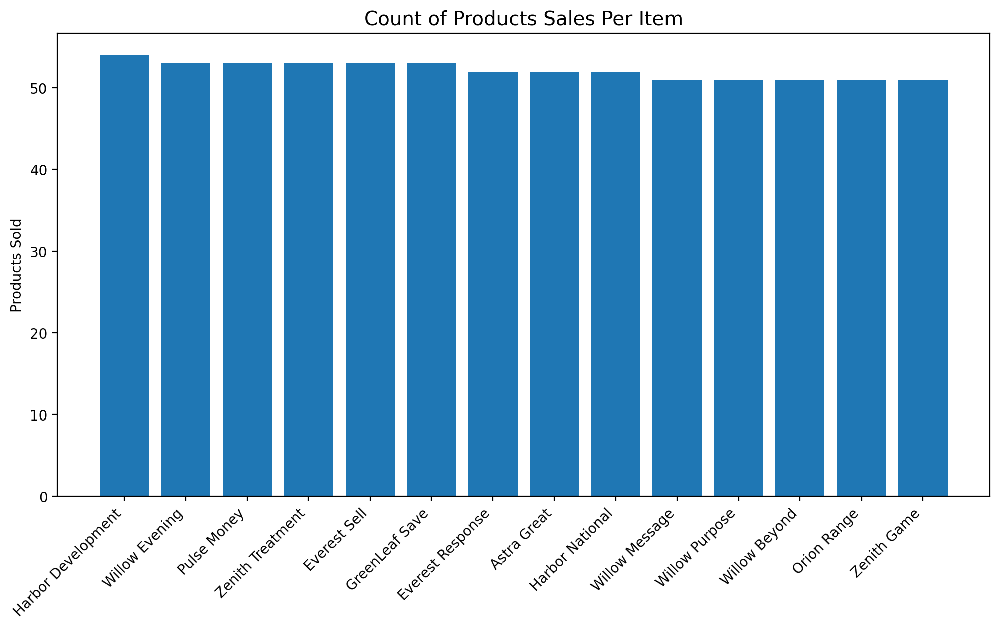

# Funnel-Analysis-E-Commerce

## Table of Contents
- [Executive Summary](#Executive-Summary)
- [Project Background](#Project-Background)
- [Data Quality](#Data-Quality)
- [Methods](#Methods)
- [User Funnel Journey](#User-Funnel-Journey)
- [User Engagement and Activity](#User-Engagement-and-Activity)
- [Revenue Metrics](#Revenue-Metrics)
- [Product Performance](#Product-Performance)
- [Comparative Performance Analysis](#Comparative-Performance-Analysis)
- [Acknowledgements](#Acknowledgements)

## Executive Summary

Funnel analysis will identify bottlenecks in the user experience and develop a series of possible solutions with the objective of increasing customer retention and encouraging user spending. Additionally, a comparative performance review was conducted on Harbor and GreenLeaf clothing brands to assess profitability and provide an informed partnership decision.

Based on the analysis, the following strategies are suggested to improve conversion rates, customer satisfaction, and profitability:

- Add a rewards program to incentivize repeat engagement.
- Introduce third party quality control with an emphasis on meeting customer expectations.
- Create in-store promotions, including apparel-specific discount days.
- Provide tools for price comparison using our site vs our competitors.

The above suggestions stem from the necessity to increase customer retention: adding a rewards program and creating in-store events incentivise further use, while better customer support and site comparison are meant to improve the customer experience.

## Project Background
A considerable amount of users choose to not use our services despite creating an account: approximately 70% of users who create an account do not make any purchase. Furthermore, 66% of products are wishlisted and not purchased.  Even if a transaction is successful, 50% of products are eventually returned. 
The aim of this project is to identify bottlenecks in the user journey and create data-backed solutions with the goal of improving customer retention, conversion rates, and site use using SQL, Python, and Tableau.

## Data Quality
After some inspection, several issues arose with the quality of the data. For instance, a section of the data included user events, or the actions that a user was capable of performing (e.g. view, purchase, wishlist, and cart). The typical path for any individual who seeks to purchase an item is either view to cart to purchase, or view to purchase. Unfortunately, the way this dataset was simulated was such that the order of the events and their timeline was randomized, and thus certain points of the funnel returned no values, or returned unreasonably long lengths in time. 

The issue of date randomization occurred throughout all relevant tables; this led to cases where reviews were placed before the order was received, or orders were made prior to the creation of an account. These two situations are addressed in the methods section. The impact of this randomization, however, resulted in time spans between user actions and the order processing path itself that is unrealistic.

Other qualities that were randomized were the product rating, price, and product sales. As such, data in the section [Product Performance](#Product-Performance) is inaccurate and inconsistent, although possible explanations for the observed behavior are offered.

## Methods

### Flagging Anomalous Behavior
A significant number of users displayed one or both of the following traits: there existed users who chose not to create an account, but used our services to purchase an item, and there were users who chose to review items before receiving them. The latter of the issues mentioned is problematic as reviews can impact the impression on users browsing a product, and potentially change its purchase rate. To address both of these issues, separate SQL queries using CASE statements were created to flag users who displayed either of the mentioned traits.

### Data Cleaning
A couple of questions emerged regarding the amount of individuals within the dataset who made an account but never purchased an item. For these cases, a SQL query using EXCEPT was created to retrieve the pertinent list of individuals.

### Logic Behind the Funnel
A user may not always have the necessary funds required to spend on any products. Such a user may instead choose to store said product in the "wishlist" category. In order to determine if users deem the price of our products as being outside of their budget, I counted the amount of items that were either purchased or wishlisted; in cases where there was not enough data to conclusively determine if a product was more purchased than wishlisted, a separate category (*Marginal Difference*) was given for these products.

### Tools Used for Analysis

A majority of the analysis performed during the course of this assignment was primarily conducted on MySQL. The SQL queries used were created using subqueries, CTEs, RANK(), CASE statements, and aggregate functions. The results of queries were typically stored as csv files, which were used in conjunction with Tableau and Python for further analysis. In cases when aggregate functions were used to obtain singular values (e.g. an average), the result was written as a comment at the bottom of the mysql file.

The possibility for further filtration by product, brand, or product category is added as global filters in Tableau for more granular performance analysis.

## User Funnel Journey
On average, if a user chose to use our site before creating an account, it took them about 226 days to create one. The users who chose to begin using our site spent more than 250 days before taking any action:

| User Action | Average Time for Action (days)|
|---|---|
|purchase|272.81|
|view|272.81|
|cart|267.10|
|wishlist|263.78|

Users who viewed a product before buying it spent approximately 130 to 140 days before purchasing it. If a product was purchased and the order was either kept or returned, the average user spent about 220 days before leaving a review, with the most amount of time from receiving a product to reviewing it being 672 days, or 1.84 years.

As noted before, the numbers mentioned here are unrealistic and are a result of the randomization of dates inherent to the simulated data.

## User Engagement and Activity

During my analysis, I found that 7,000 active users were found to have created an account, but chose never to make a purchase. On average, if a customer used our services to buy an item, it is likely that they will use our services an average of two times throughout the lifecycle of their account.

In total, of all products that were successfully purchased or returned, 65.54% of products received no review. In this dataset, users have the possibility of performing one of the following actions: view, purchase, wishlist, and cart. Typically, an individual will perform approximately 8 actions throughout the lifecycle of their account.

As mentioned in the Data Quality section, the data simulation assigned randomized dates and order of events, so a true funnel was not possible. The SQL query used to determine the path taken by individuals who completed a purchase found that only 3 cases existed where viewing a product resulted in a successful purchase, while about 59,000 other purchases followed another path that did not conclude in a purchase.

## Revenue Metrics
The average order value was found to be $595.93. When separated by category, a user will likely spend the following approximate amounts per order:

|category|Average Spent Per Category (USD)|
|---|---|
|Pet Supplies|82.60|
|Beauty|134.28|
|Automotive|644.18|
|Books|70.31|
|Electronics|1285.76|
|Toys|90.70|
|Home & Kitchen|292.38|
|Groceries|25.17|
|Clothing|171.23|
|Sports|258.38|

On average, customers spend most of their money on Electronics than on any other category.

## Product Performance
From our catalogue of products, 15% were purchased more than they were wishlisted, while 66% of products were wishlisted. Of the products that were bought, 50.28% are returned.

The following products were bought the most often:

### The Correlation Between Rating, Price, and Product Sales & Probable Reasoning
Pertinent to discovering the effects on a user's perception of a product are the products' price and its average rating.

*A graphical representation of the range of the amount of times a product has been bought in comparison to the rating of the product.*

Suppose the above plot was partitioned into 4 separate segments, and the x- and y- markings were removed. If an outside individual was asked to correctly rearrange the plot, it is unlikely that they would be able to do so, as the plot appears to be uniformly scattered. This scattered pattern apparent in the above plot points to a minimal correlation between how often a product is bought and its average rating, and products with low ratings are bought the same amount of times as products with higher ratings. This effect can be reasonably explained through the following thought processes:

Users who did not have a favorable experience using our website, or had an issue during shipping could have created multiple accounts and unfavorably reviewed products, skewing the data, causing it to be misrepresentative of the actual quality of the product. Since traffic to our website is low, the additional reviews have a more significant impact. This impact can also happen in the opposite direction, however, with sellers creating accounts to boost the ratings of their products.
If a product has low reviews, but has high sales it could be the case that an outside individual - such as an influencer - left a negative review on a product, which in turn created a bias in the audience of said influencer, leading to negative reviews; if the people outside of the influencer continue to purchase the item, but choose not to leave ratings, then the product will continue to have high sales. The same can also be true for products with high ratings but low sales.

*A graphical representation of the range of the amount of times a product has been bought in comparison to the price of the product.*

Although similar, the above plot does not follow the same pattern of a normal distribution; what is apparent, however, is that products with a price less than $500 are bought the most often.

## Categorizing Customers
The following 10 customers have spent the most amount per order

|user_id|		total_per_order (USD)|
|--|--|
|U000006|		7490.93|
|U009076|		7013.55|
|U002814|		6360.11|
|U005797|		6265.52|
|U005921|		6195.80|
|U004277|		6138.50|
|U009626|		6101.43|
|U005803|		6066.85|
|U002851|		5790.47|
|U000564|		5717.67|

The top 10 customers spent an average of $6314.08, an amount more than $5,000 that of the average order value.

## Comparative Performance Analysis

This portion focuses on the two most popular clothing brands: Harbor and GreenLeaf. They were determined to be the most popular clothing brands by the amount of times products from these two companies were purchased. In this portion, let’s assume it became the case that we could only host one of these two companies. 

In the table below are metrics obtained from the results from working with these two companies.

|Metric|Harbor|GreenLeaf|
|--|--|--|
|Products Sold|27|24|
|Average Product Rating|3.84|3.81|
|Average Product Price|$95.69|$114.10|
|Total Product Views|646|522|
|Distinct User Views|623|505|
|Total Product Sales|357|345|
|Distinct User Purchase Count|346|337|
|Revenue|$45,550.82|$57,842.83|

Harbor outperformed GreenLeaf in almost all metrics, and have clearly brought in more views and customers. That being said, GreenLeaf’s revenue is more than $12,000 higher than that of Harbor. The ratio of distinct purchase count to total product sales is marginally higher for GreenLeaf (97.68%) than it is for Harbor (96.62%), meaning that both companies attract approximately the same amount of distinct customers. With this in mind, it becomes apparent that GreenLeaf is more profitable and a more valuable partnership.

## Acknowledgements

